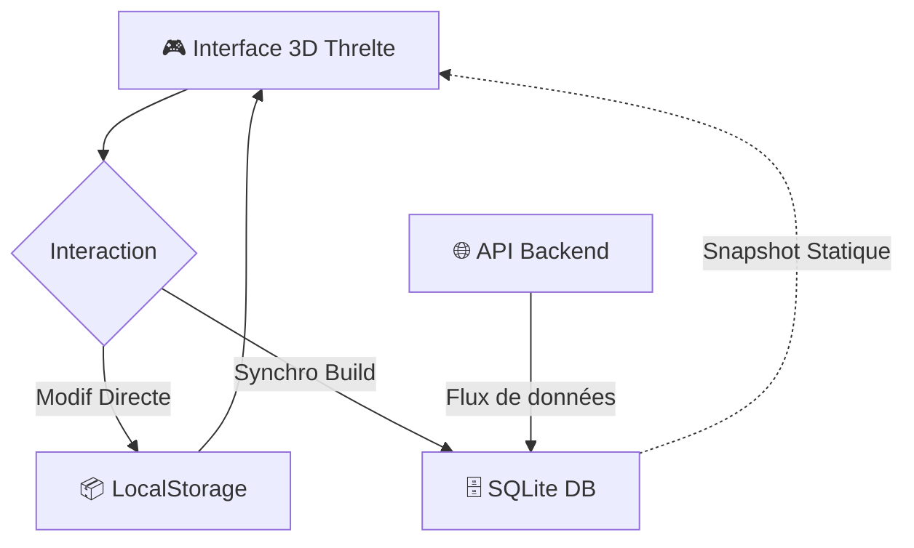

# 💎 DV-Threlte-Starter 🚀

Bienvenue dans le futur de la **3D sur le Web** ! 🌐✨ 

Ce projet est un moteur de visualisation et d'édition transforme ton navigateur en un véritable **moteur de jeu temps réel** 🎮. Que tu sois un pro de la 3D ou un curieux, tu peux créer, manipuler et sublimer des mondes en quelques clics.

---

## 🌟 Ce que tu peux faire :
- **Visualisation 3D Haute Fidélité** : Un rendu ultra-réaliste grâce aux effets **Premium** (Bloom, Réflexions HDR, Iridescence) 💎.
- **Édition Intuitive** : Ajoute des formes (boîtes 📦, sphères 🔮) ou importe tes propres modèles **.GLB** par simple drag & drop ! 🏗️
- **Manipulation Précise** : Déplace, tourne et redimensionne tes objets directement dans la scène avec des outils de transformation interactifs 🛠️.
- **Simulation Dynamique** : Crée des environnements vivants avec des éclairages physiques avancés 💡.

---

## 🛠️ L'Architecture (Comment ça marche ?)
Voici comment tes données voyagent entre ton écran et la base de données :

---

## 🗄️ Gestion de la Base de Données
Le projet utilise une stratégie de stockage hybride pour garantir que rien ne se perd ! 🧬

| Ressource | Lien d'accès 🔗 | Description 📝 |
| :--- | :--- | :--- |
| **Tableau de Bord** | [Ouvrir l'Inventaire 📋](https://dvrch.github.io/dv-threlte-starter/data/inventory.html) | Vue visuelle de tous les objets stockés lors du dernier build. |
| **Base SQLite** | [Télécharger .sqlite 💾](https://dvrch.github.io/dv-threlte-starter/data/inventory.sqlite) | Le fichier de base de données complet pour une utilisation externe. |
| **Types JSON** | [Voir les Types 🧬](https://dvrch.github.io/dv-threlte-starter/data/types.json) | Liste des géométries disponibles (box, spaceship, etc.). |

> [!IMPORTANT]
> **Est-ce que je peux modifier la BD en ligne ?** 🧐
> - La page HTML et le fichier `.sqlite` sont des **instantanés (Snapshots)** générés lors du build. Ils ne changent pas en temps réel sur le serveur.
> - **MAIS**, chaque modification que tu fais sur le site est sauvegardée **instantanément** dans ton navigateur (LocalStorage). Ta scène personnalisée t'appartient ! 🏠✨

---

## 🚀 Fonctionnalités Clés
- 🏎️ **Performance Max** : Basé sur Svelte 5 et Threlte pour une fluidité incroyable.
- 🔗 **Mode Hybride** : Marche avec un Backend Django ou en mode 100% Statique sur GitHub Pages.
- 🎨 **Matériaux "Premium"** : Tes objets brillent, reflètent et réagissent à l'environnement HDR global.
- 📦 **Zéro Configuration** : Uploade tes modèles et commence à créer sans toucher au code !

---

Prêt à construire ton propre univers ? **Fonce !** 🕺💨
